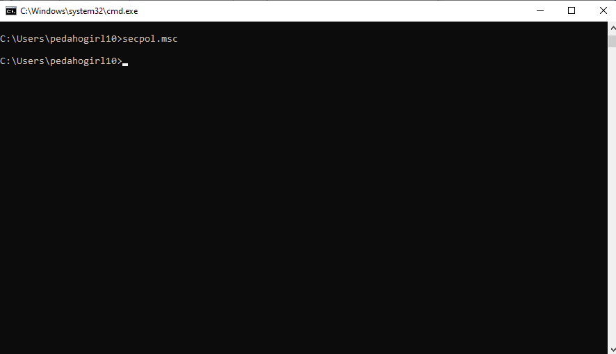
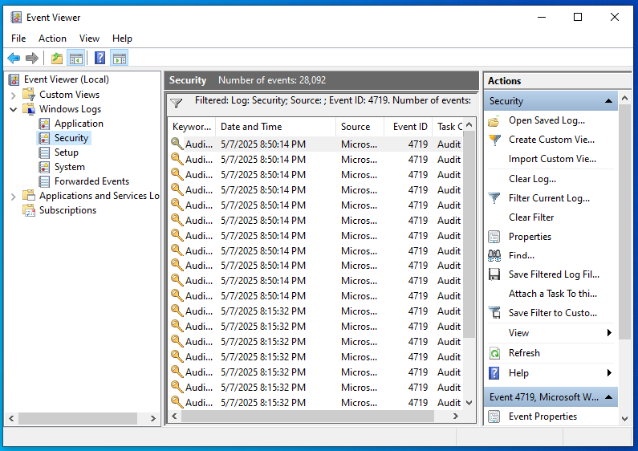
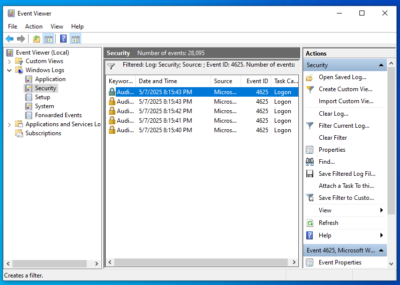
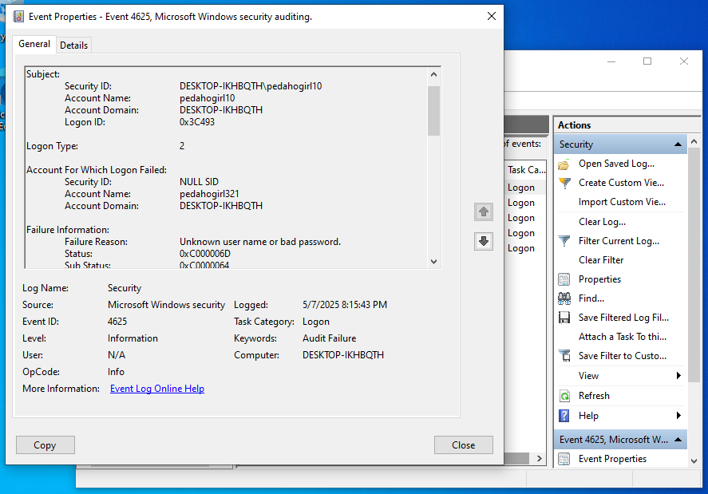

# Log-Analysis-System-Lab

## Objective

Simulate the log analysis process using Windows Event Viewer on a Windows 10 LTSC VM performed in Oracle VirtualBox to detect suspicious activities such as failed logins, administrator account usage, folder/file access with active auditing, and changes to audit policies.

## Skills Learned

- Able to analyze and interpret system activity logs with Event ID
- Detect potential security incidents on the system
- Recognize signs of suspicious activity on the system
- Increased knowledge of system vulnerabilities
- Development of critical thinking

## Tools Used

- Windows 10 LTSC Operating System (VM)
- Oracle VirtualBox (Host-Only Network)
- Event Viewer to filter and analyze logs by Event ID
- Command Prompt

## Steps

#### Enable audit login failure (System Audit Policy was Changed)
This is the first step that can be taken when the Event ID/Log does not appear in the Event Viewer or recent activity is not detected.  
=> The steps:
- Run the command: secpol.msc  
  
- Go to Local Policies > Audit Policy > Audit Logon Events > Check 'Success' and 'Failure'
- Event ID 4719 appears in the Event Viewer log.  
    

Note: Event id 4719 arose due to a change in audit policy on logon/logoff.

#### Simulation 1: Simulated brute-force login (Failed Logon)
=> The steps:
- Running the command: for /l %i in (1,1,5) do runas /user:pedahogirl321 cmd
- Entering an arbitrary password 5 times
- Check the log in Event Viewer with Event ID 4625  

Why event id 4625?  
Because Event ID 4625 is the Security ID for login failure information.  

=> The results:  

  

=> The analysis:  
- Timestamp: 2025-05-07 20:15
- Event ID: 4625
- Log type: 2 (Security)
- Description: Login failure of user 'pedahogirl321'. Indication of brute-force attempt.  

The account that failed to log in was 'pedahogirl321'. From the failure information, it appears that the username or password is incorrect. This can be indicated as a brute-force attack, because there were attempts to enter the password more than 2 times at the same time. Usually, if the admin enters the wrong password it is only 1 or 2 times.

#### Simulation 2:
=> The steps:
=> The results:  
=> The analysis:  
jangan lupa tambahin note atau keterangan ttg event id nya !!!!

## Conclusion
ini kesimpulan dari semuanya
