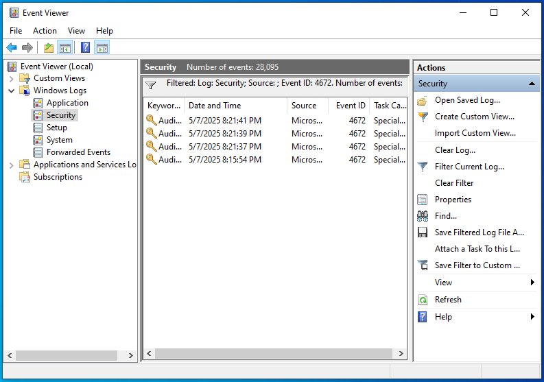
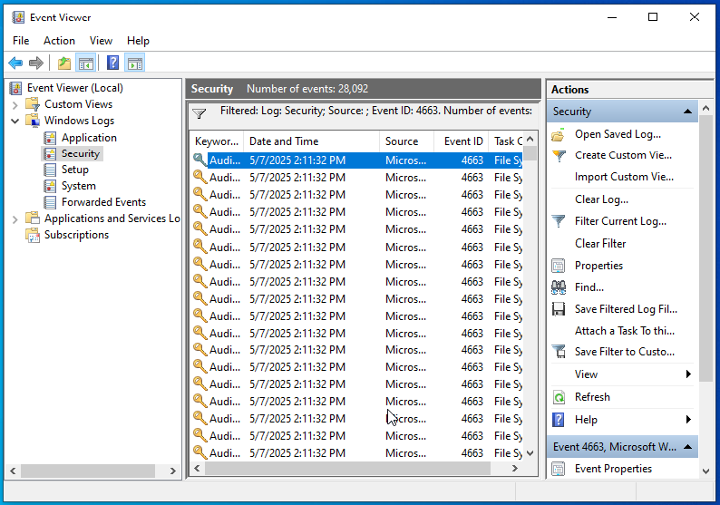
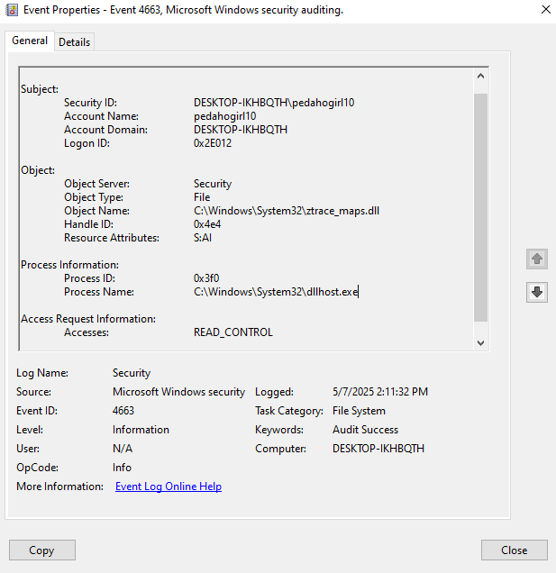

# Log Analysis System Lab

Log Analysis ang Detect Suspicious Activity

## Objective

Simulate the log analysis process using Windows Event Viewer on a Windows 10 LTSC VM performed in Oracle VirtualBox to detect suspicious activities such as failed logins, administrator account usage, folder/file access with active auditing, and changes to audit policies.

## Skills Learned

- Able to analyze and interpret system activity logs with Event ID
- Detect potential security incidents on the system
- Recognize signs of suspicious activity on the system
- Increased knowledge of system vulnerabilities
- Development of critical thinking

## Tools Used

- Windows 10 LTSC Operating System (VM)
- Oracle VirtualBox (Host-Only Network)
- Event Viewer to filter and analyze logs by Event ID
- Command Prompt

## Steps

#### Enable audit login failure (System Audit Policy was Changed)
This is the first step that can be taken when the Event ID/Log does not appear in the Event Viewer or recent activity is not detected.  
=> The steps:
- Run the command: secpol.msc  
  
- Go to Local Policies > Audit Policy > Audit Logon Events > Check 'Success' and 'Failure'
- Event ID 4719 appears in the Event Viewer log  
    

Note: Event id 4719 arose due to a change in audit policy on logon/logoff.

#### Simulation 1: Simulated brute-force login (Failed Logon)
=> The steps:
- Running the command: for /l %i in (1,1,5) do runas /user:pedahogirl321 cmd
- Entering an arbitrary password 5 times
- Check the log in Event Viewer with Event ID 4625  

Why event id 4625?  
Because Event ID 4625 is the Security ID for login failure information.  

=> The results:  

  

=> The analysis:  
- Timestamp: 2025-05-07 20:15
- Event ID: 4625
- Log type: 2 (Security)
- Description: Login failure of user 'pedahogirl321'. Indication of brute-force attempt.  

The account that failed to log in was 'pedahogirl321'. From the failure information, it appears that the username or password is incorrect. This can be indicated as a brute-force attack, because there were attempts to enter the password more than 2 times at the same time. Usually, if the admin enters the wrong password it is only 1 or 2 times.

#### Simulation 2: Simulation of administrator account usage (Special Privilages)
=> The steps:
- Running CMD with 'Run as Administrator'
- Check the log in Event Viewer with Event ID 4672  

=> The results:  
  

=> The analysis:  
- Timestamp: 2025-05-07 20:21
- Event ID: 4672
- Log type: 2 (Security)
- Description: `Administrator` gains special privileges.  

Note: Typically used by system admins for operations with authorized/legal access. Event ID 4672 indicates someone logged into the system using a highly privileged account.

#### Simulation 3: Simulated access of protected folder/file (An attempt was made to access an object)
=> The steps:
- Run the command: secpol.msc
- Enable File System Audit in Advanced Audit Policy Configuration > Object Access
- Added user 'Everyone' with List Folder/Read Data access rights to the Properties folder C:\Windows\System32
- Opened the folder without permission
- Check the log in Event Viewer with Event ID 4663  

=> The results:  

  

=> The analysis:  
- Timestamp: 2025-05-07 14:11
- Event ID: 4663
- Log type: 2 (Security)
- Description: There appears to be an attempt to READ access to important files.  

Event ID 4663 indicates that access has been performed. By understanding and monitoring Event ID 4663, system administrators can improve security and ensure that access to system resources is properly supervised.

### Log Collection Steps
- Opening the Event Viewer with Win+R: 'eventvwr'
- Using 'Filter Current Log' to analyze the Security log:
  - Event ID 4719 (System Audit Policy was Changed)
  - Event ID 4625 (Failed Logon)
  - Event ID 4672 (Special privileges)
  - Event ID 4663 (An attempt was made to access an object)

### Advice
- If Event ID 4719 appears but the admin does not change the audit policy, it can be suspicious because it is possible that hackers/attackers can turn off auditing to hide traces before carrying out a cyberattack.
- Event ID 4625 Failed Logon needs to be checked at certain hours or circumstances.
- Event ID 4672 indicates someone logged in using a highly privileged account. It could indicate access to sensitive systems. Check the Event ID if it appears and the system admin did not do this.
- If Event ID 4663 appears and the admin is not accessing protected folders/files, check the File System Audit configuration.

## Conclusion
Through this simulation, I understood how Windows Event Viewer works to detect potential security incidents, as well as the basic skills of analyzing logs and recognizing signs of suspicious activity.
